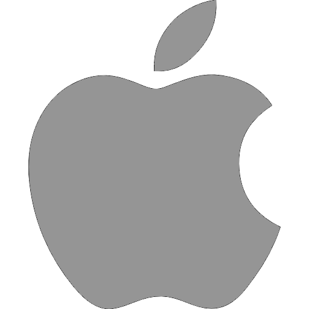

# :space_invader:	Hi everybody, I’m Dano :space_invader:	
>I'm a multiplatform app developer in process 👨‍🎓 who likes a lot typping code.
>
>I would like to make good projects alone or in group.

## Languages I use:
<!-- Lenguages table -->
<table>
  <tr>
    <td>
      <!-- Lenguajes I know -->
      <table>
        <tr><th>Language</th><th>Primary use</th></tr>
        <tr><td>Java</td><td>Android apps</td></tr>
        <tr><td>C#</td><td>Unity videogames</td></tr>
        <tr><td>HTML, CSS, PHP</td><td>Web development</td></tr>
        <tr><td>SQL, PHP</td><td>Databases, web apps</td></tr>
      </table>
    </td>
    <td>
      <!-- Most used chart -->
      
    </td>
  </tr>
</table>

## Starting with:
- I'm starting to learning `Python` lenguage 
- I'm starting to learning also `Swift` for iPhone apps 
