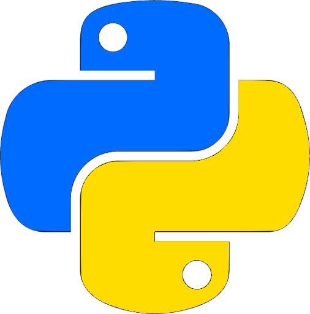

# :space_invader:	Hi everybody, I’m @CyberDano :space_invader:	
*Student and secondary account. Primary account is <a href="https://github.com/LeoDanoGG" target="_blank">`LeoDanoGG`</a>*
---
>I'm a multiplatform app developer in process 👨‍🎓 who likes a lot typping code.
>
>I would like to make good projects alone or in group.
## Lenguages I ussualy use:
|Code|Main use|
|---|---|
|Java|Android apps|
|C#|Unity videogames|
|html, css, php|Webs|
|SQL, php|Data base, web apps|
## Starting with
- I'm starting to learning Python lenguage 
- I'm starting to learning also Swift for iPhone apps 
