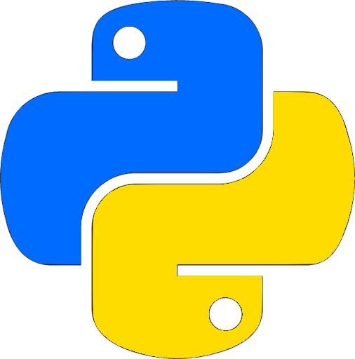
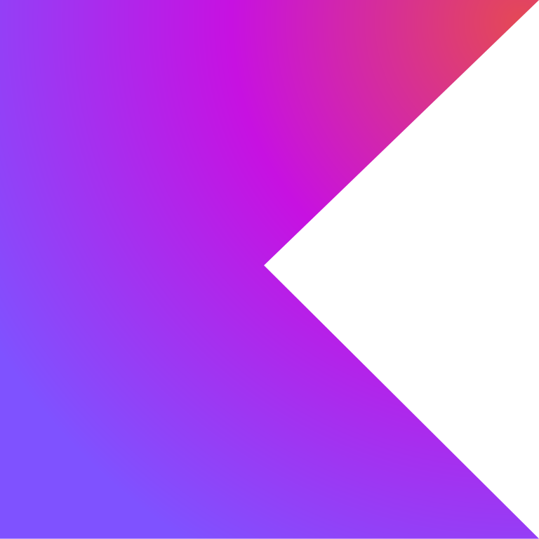
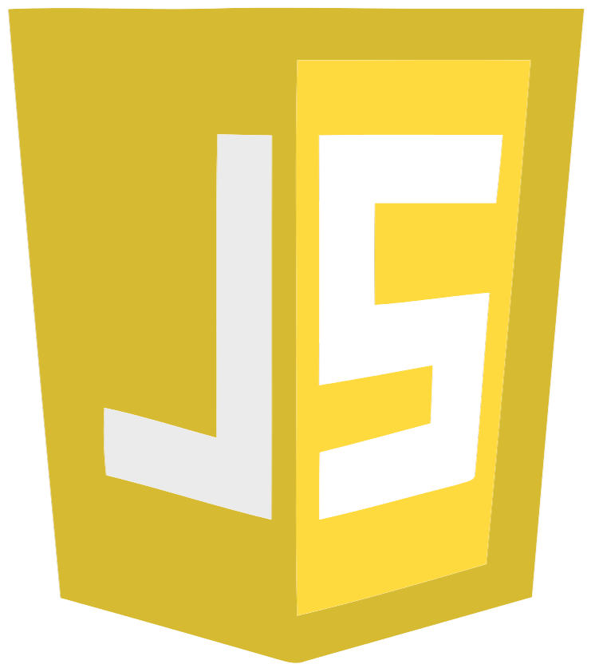

# :space_invader:	Hi everybody, it's Dano  
I'm a multiplatform app developer in process 👨‍🎓 who really enjoys coding.

I am passionate about programming and always eager to learn more about computer science. My innate curiosity led me to wonder how my home router worked, which marked the beginning of my journey into this world. While studying backend and networking to understand how that small device operated, I discovered the vast possibilities hidden within the world of binary code. But I didn’t stop there; I decided to take it a step further and learn how to write my own code, exploring the magic of technological creation

## :dart: Objectives
I would like to make good projects alone or in group.
- Work in effective projects.
  - Develop optimized apps.
  - Improve existing apps.
- Explore new technologies.
- Keep learning everyday.
- Work with other programmers.

##  Languages I use

  <table>
    <tr>
      <td>
        <table><!-- Lenguajes I know -->
          <tr><th>Language</th><th>Primary use</th></tr>
          <tr><td>Dart</td></td><td>Multi-device apps</td></tr>
          <tr><td>Java, Swift</td><td>Mobile apps</td></tr>
          <tr><td>C#</td><td>Unity videogames</td></tr>
          <tr><td>HTML, CSS, PHP</td><td>Web development</td></tr>
          <tr><td>SQL, PHP</td><td>Databases, web apps</td></tr>
        </table>     
      </td>
      <td>
        
<!-- Most used chart -->
          
        

      </td>
    </tr>
  </table>

### Starting with:
- Python  for learn about AI.
- Kotlin  for apps in Android with a modern language.
- Javascript  for dynamic activities in web.

## :toolbox: Main projects 

  <table>
    <tr>
      <td>
Video game
</td><td>&nbsp;<!-- Split -->&nbsp;</td>
      <td>
Wiki with an API
</td><td>&nbsp;<!-- Split -->&nbsp;</td>
      <td>
Room manager
</td>&nbsp;<!-- Split -->&nbsp;</td>
      <!--<td>

</td>-->
    </tr>
    <tr>
      <td></td><td>&nbsp;<!-- Split -->&nbsp;</td>
      <td></td><td>&nbsp;<!-- Split -->&nbsp;</td>
       <td></td>&nbsp;<!-- Split -->&nbsp</td>
      <!--<td></td>-->
    </tr>
  </table>

